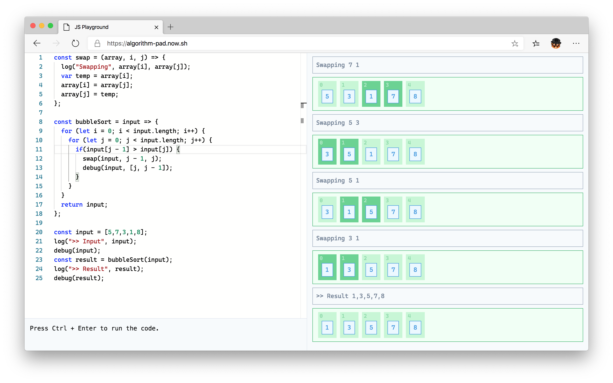

# Yet another JS Playground

This time, with some decent data structure visualization.



Try it online at: https://algorithm-pad.now.sh

Usage:

- Just write your code normally
- Whenever you want to visualize your data, use `debug()`.
- Whenever you want to print a log, use `log()`.

For example:

```
const str = "Hello World";
// Visualize a string
debug(str);
// Highlight a 3rd character
debug(str, 2);
// Highlight a range of charager
debug(str, [1,2,3]);
```
